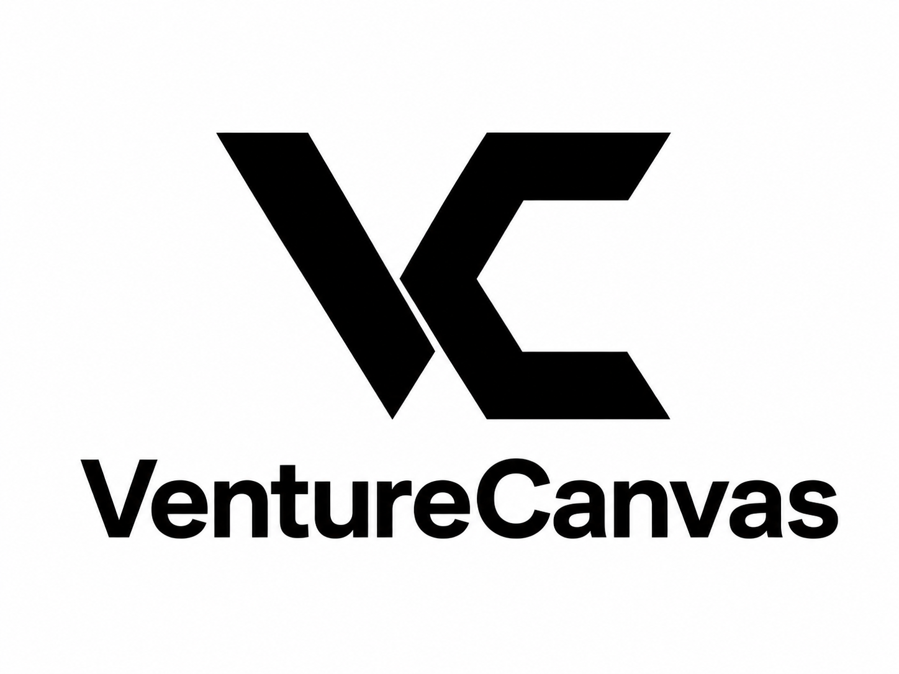
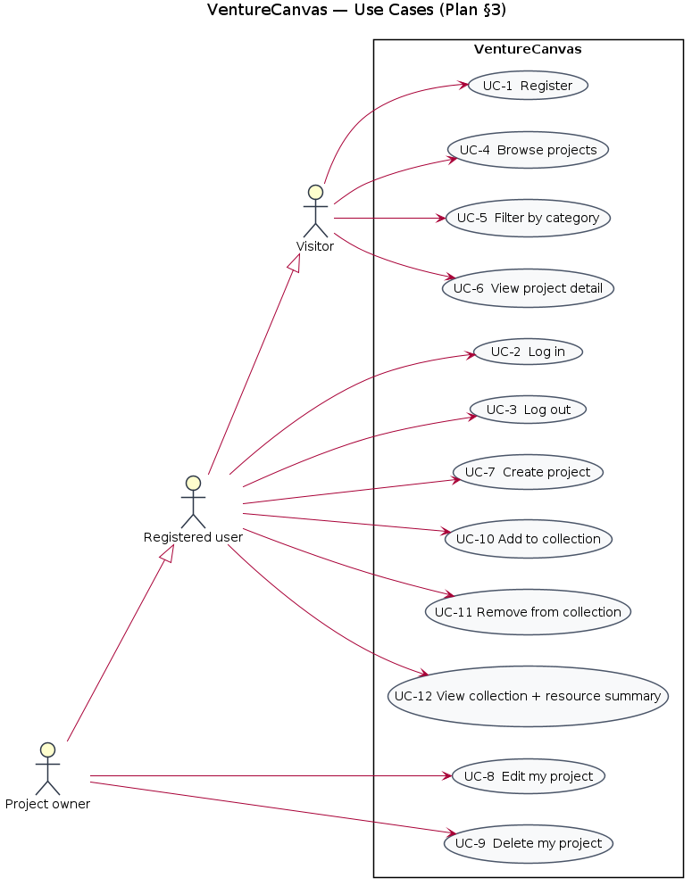
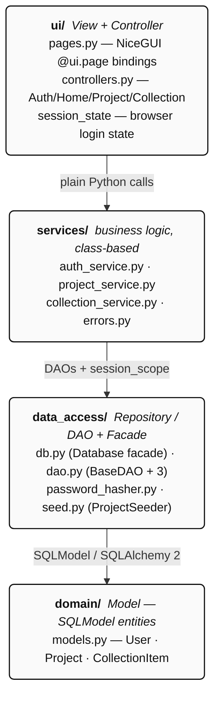
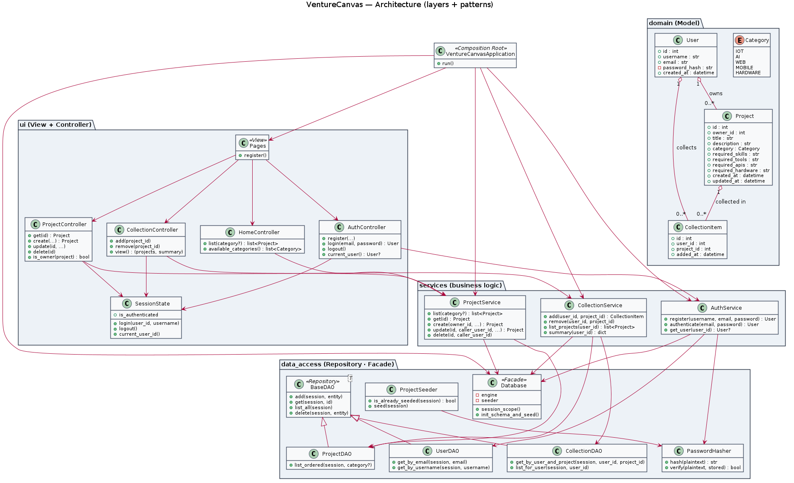
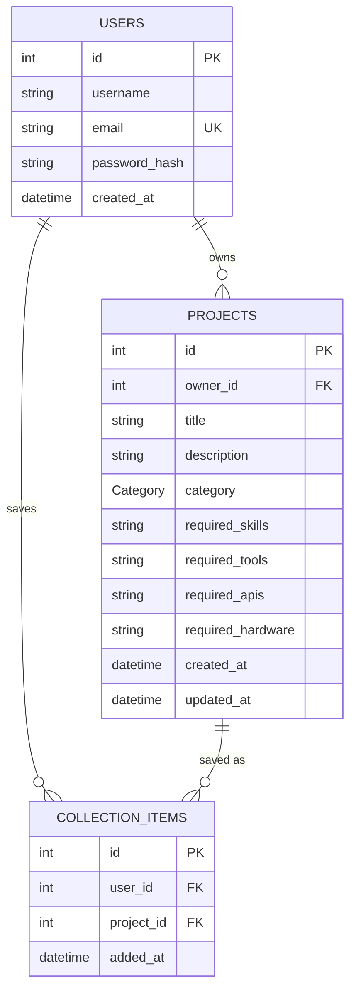
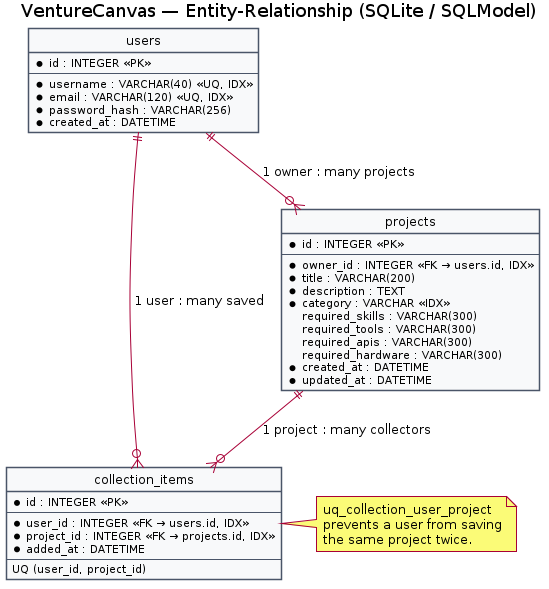
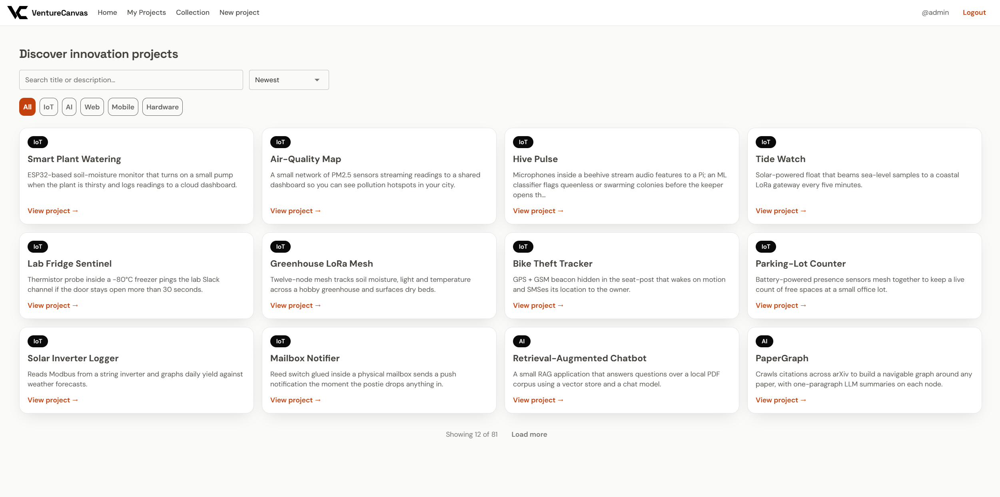
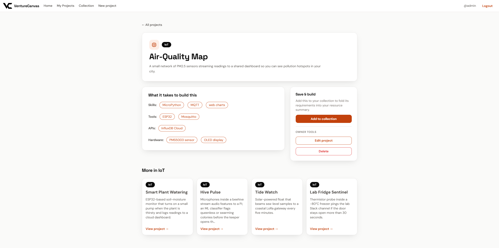
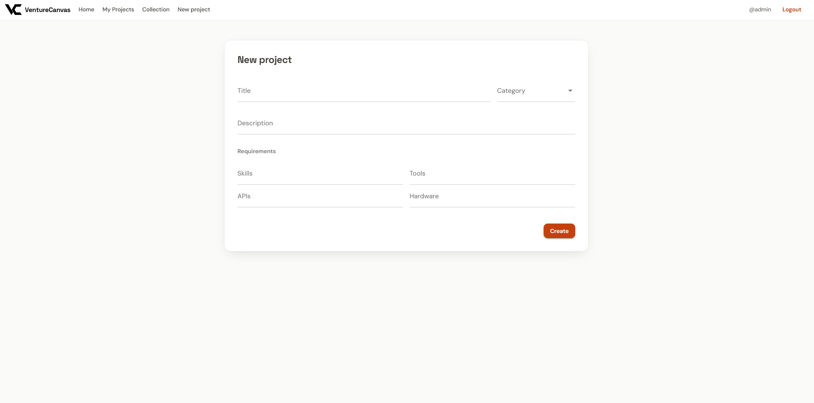
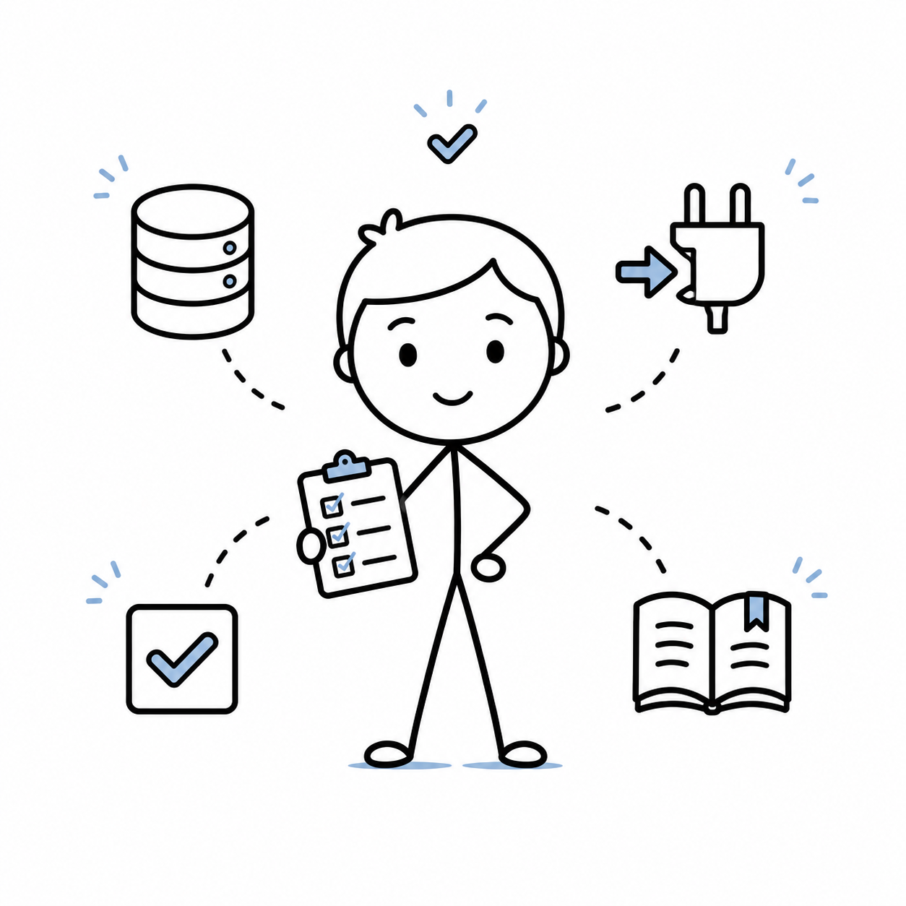

<!-- ════════════════════════════════════════════════════════════════════════════ -->
<!--                                  HERO                                       -->
<!-- ════════════════════════════════════════════════════════════════════════════ -->

<div align="center">

<br/>

<picture>
  <source media="(prefers-color-scheme: dark)" srcset="docs/offical_logo.png" />
  
</picture>

<br/>

<a href="#-highlights">
  <picture>
    <source media="(prefers-color-scheme: dark)" srcset="https://readme-typing-svg.demolab.com?font=JetBrains+Mono&weight=700&size=22&pause=1500&color=FFFFFF&center=true&vCenter=true&width=620&lines=Discover+ideas.;Curate+collections.;Aggregate+resources.;Build+together." />
    
  </picture>
</a>

<br/>

<h3>A community-driven platform for innovation projects</h3>

<sub><b>SHARE IDEAS  ·  BUILD TOGETHER  ·  CREATE IMPACT</b></sub>

<br/><br/>

<p>
  
  
  
  
  
  
</p>

<sub>
  <a href="#-highlights"><b>Highlights</b></a>  ·
  <a href="#1--user-stories"><b>User Stories</b></a>  ·
  <a href="#2--use-cases"><b>Use Cases</b></a>  ·
  <a href="#3--architecture"><b>Architecture</b></a>  ·
  <a href="#4--database--orm"><b>Database</b></a>  ·
  <a href="#8--how-to-run"><b>Setup</b></a>  ·
  <a href="#9--testing"><b>Tests</b></a>  ·
  <a href="#11--team--contributions"><b>Team</b></a>
</sub>

</div>

---

<!-- ════════════════════════════════════════════════════════════════════════════ -->
<!--                            ACADEMIC PARTNER                                 -->
<!-- ════════════════════════════════════════════════════════════════════════════ -->

<div align="center">

### 🎓 &nbsp; Academic Partner

<a href="https://www.fhnw.ch"><b>FHNW</b> — University of Applied Sciences and Arts Northwestern Switzerland</a>

<sub>Built for the <b>Object-Oriented Programming</b> module &nbsp;·&nbsp; <b>Frühlingssemester 2026 (FS26)</b></sub>

<sub><i>Lecturers</i> &nbsp;·&nbsp; <a href="https://www.fhnw.ch/de/wirtschaft/ueber-uns/portrait-organisation/personen/hermann-grieder">Hermann Grieder</a> &nbsp;·&nbsp; <a href="https://www.fhnw.ch/de/wirtschaft/ueber-uns/portrait-organisation/personen/felix-haerer">Felix Härer</a></sub>

</div>

---

<!-- ════════════════════════════════════════════════════════════════════════════ -->
<!--                          PROJECT DESCRIPTION                                -->
<!-- ════════════════════════════════════════════════════════════════════════════ -->

## Project description

This web platform serves as a central hub where users can present, discover, and further develop their innovative projects.

Users can upload their own projects and present them in detail, including descriptions, files, and additional information. At the same time, they can browse through other users' projects and find inspiration.

A central component of the platform is interaction within the community: projects can be commented on, discussed, and rated. Users can purchase and download projects or associated files to reuse them or use them as a basis for their own developments. Overall, the platform combines presentation, collaboration, and monetization.

<div align="center">

`🏗 Three-layer Architecture`  `🐍 Pure Python`  `🎨 NiceGUI`  `🗄 SQLModel`  `✅ 14 Tests Green`

</div>

---

<!-- ════════════════════════════════════════════════════════════════════════════ -->
<!--                              ✨ HIGHLIGHTS                                  -->
<!-- ════════════════════════════════════════════════════════════════════════════ -->

## ✨ Highlights

<table>
<tr>
<td width="25%" align="center" valign="top">

### 🔭
**Discover**

Browse every published project — newest first, filterable by category chip.

</td>
<td width="25%" align="center" valign="top">

### 📌
**Curate**

Add anything that sparks your interest to your personal collection.

</td>
<td width="25%" align="center" valign="top">

### 🧮
**Aggregate**

Your collection auto-summarises every skill, tool, API and piece of hardware you'd need.

</td>
<td width="25%" align="center" valign="top">

### 🚀
**Build**

Create, edit and manage your own projects — pure Python, no JS toolchain.

</td>
</tr>
</table>

---

<!-- ════════════════════════════════════════════════════════════════════════════ -->
<!--                              INSPIRATION                                    -->
<!-- ════════════════════════════════════════════════════════════════════════════ -->

## Inspiration

> Many people have a notebook full of project ideas — a soil moisture meter, a RAG chatbot, a mechanical keyboard — but no central place where they can record them, present them, or figure out what it would cost to bring several of these ideas to life at once in terms of parts, services, and expertise.
>
> **VentureCanvas solves exactly this problem:** a small community gallery where every user can publish their own projects and collect interesting ideas from others. The "Collection" view does the heavy lifting: it summarizes the required skills, tools, APIs, and hardware for all saved projects, so the curator can see the entire shopping list at a glance.

---

<!-- ════════════════════════════════════════════════════════════════════════════ -->
<!--                            1 · USER STORIES                                 -->
<!-- ════════════════════════════════════════════════════════════════════════════ -->

## 1 · User Stories

Thirteen features, thirteen user stories — one per row in §4.

> **Roles legend** &nbsp;·&nbsp; 👤 Visitor &nbsp;·&nbsp; 🔐 Logged-in user &nbsp;·&nbsp; 👑 Project owner

| # | Role | Story |
|---|---|---|
| 1 | 👤 | As a visitor, I want to **register an account** so that I can contribute and curate. |
| 2 | 👤 | As a returning user, I want to **log in** so that my projects and collection are restored. |
| 3 | 🔐 | As a logged-in user, I want to **log out** so that nobody else can use my browser session. |
| 4 | 👤 | As any visitor, I want to **browse all projects** so that I can discover what others are building. |
| 5 | 👤 | As any visitor, I want to **filter projects by category** (IoT · AI · Web · Mobile · Hardware) so that I can narrow the list to what interests me. |
| 6 | 👤 | As any visitor, I want to **see a project's details** so that I understand what's required to build it. |
| 7 | 🔐 | As a logged-in user, I want to **create a project** so that the community can see what I'm working on. |
| 8 | 👑 | As the owner of a project, I want to **edit** it so that I can keep its description current. |
| 9 | 👑 | As the owner of a project, I want to **delete** it so that outdated ideas don't clutter the gallery. |
| 10 | 🔐 | As a logged-in user, I want to **add a project to my collection** so that I can come back to it later. |
| 11 | 🔐 | As a logged-in user, I want to **remove a project from my collection** so that my shortlist stays clean. |
| 12 | 🔐 | As a logged-in user, I want to see **my collection plus a resource summary** so that I know which skills, tools, APIs and hardware my whole shortlist requires. |
| 13 | 🔐 | As a logged-in user, I want to **see all my own projects in one place** so that I can quickly find and manage what I have built. |

---

<!-- ════════════════════════════════════════════════════════════════════════════ -->
<!--                              2 · USE CASES                                  -->
<!-- ════════════════════════════════════════════════════════════════════════════ -->

## 2 · Use Cases

Each use case maps one-to-one to the story of the same number. Click a group to expand its tables.

<details>
<summary><b>🔐 &nbsp;Account</b> &nbsp;—&nbsp; UC-1 Register · UC-2 Log in · UC-3 Log out</summary>

<br/>

### UC-1 — Register
| | |
|---|---|
| **Actor** | Visitor |
| **Pre-condition** | No active session in the browser |
| **Main flow** | Open `/register` → fill username, email, password → submit → account is stored with a PBKDF2 hash → user is redirected to `/login`. |
| **Post-condition** | A new `User` row exists with a hashed password. |

### UC-2 — Log in
| | |
|---|---|
| **Actor** | Registered user |
| **Pre-condition** | An account with that email exists |
| **Main flow** | Open `/login` → enter email + password → `AuthService.authenticate` verifies the PBKDF2 hash → `SessionState.login` stores `user_id` in the browser storage → redirect to `/`. |
| **Post-condition** | The browser is authenticated until logout. |

### UC-3 — Log out
| | |
|---|---|
| **Actor** | Logged-in user |
| **Pre-condition** | Authenticated session |
| **Main flow** | Click *Logout* in the header → `SessionState.logout` clears the browser storage → redirect to `/`. |
| **Post-condition** | The browser is anonymous again. |

</details>

<details>
<summary><b>🔭 &nbsp;Browse & Detail</b> &nbsp;—&nbsp; UC-4 Browse · UC-5 Filter · UC-6 View detail</summary>

<br/>

### UC-4 — Browse projects
| | |
|---|---|
| **Actor** | Any visitor |
| **Pre-condition** | None |
| **Main flow** | Open `/` → `HomeController.list()` calls `ProjectService.list()` → every project is rendered as a card, newest first. |
| **Post-condition** | The home grid reflects the current DB state. |

### UC-5 — Filter by category
| | |
|---|---|
| **Actor** | Any visitor |
| **Pre-condition** | Home page visible |
| **Main flow** | Click a category chip → `HomeController.list(category=…)` → only projects of that category appear. |
| **Post-condition** | The filter is active until the user clicks *All* or another chip. |

### UC-6 — View project detail
| | |
|---|---|
| **Actor** | Any visitor |
| **Pre-condition** | The target project exists |
| **Main flow** | Click a project card → navigate to `/project/{id}` → `ProjectService.get` loads the record → title, description, category and requirement chips render. |
| **Post-condition** | The detail page is shown; if the viewer owns the project, *Edit* and *Delete* buttons appear. |

</details>

<details>
<summary><b>📝 &nbsp;Project CRUD</b> &nbsp;—&nbsp; UC-7 Create · UC-8 Edit · UC-9 Delete</summary>

<br/>

### UC-7 — Create a project
| | |
|---|---|
| **Actor** | Logged-in user |
| **Pre-condition** | Authenticated session |
| **Main flow** | Open `/project/new` → fill title, description, category, requirements → submit → `ProjectService.create` validates and persists → redirect to the new project's detail page. |
| **Post-condition** | A new `Project` row exists owned by the caller. |

### UC-8 — Edit my project
| | |
|---|---|
| **Actor** | Project owner |
| **Pre-condition** | The caller owns the target project |
| **Main flow** | Open `/project/{id}/edit` → change any field → submit → `ProjectService.update` re-checks ownership and validates title/description → redirect back to detail. |
| **Post-condition** | The record is updated and `updated_at` is refreshed. |

### UC-9 — Delete my project
| | |
|---|---|
| **Actor** | Project owner |
| **Pre-condition** | The caller owns the target project |
| **Main flow** | On `/project/{id}` click *Delete* → `ProjectService.delete` re-checks ownership → ORM cascade removes related `CollectionItem` rows → redirect home. |
| **Post-condition** | The project and any of its collection links are gone. |

</details>

<details>
<summary><b>⭐ &nbsp;Collection & Mine</b> &nbsp;—&nbsp; UC-10 Add · UC-11 Remove · UC-12 Summary · UC-13 My projects</summary>

<br/>

### UC-10 — Add to collection
| | |
|---|---|
| **Actor** | Logged-in user |
| **Pre-condition** | Authenticated session, target project exists |
| **Main flow** | On `/project/{id}` click *Add to collection* → `CollectionService.add` checks for duplicates → inserts a `CollectionItem`. |
| **Post-condition** | The project appears on `/collection` and contributes to the summary. |

### UC-11 — Remove from collection
| | |
|---|---|
| **Actor** | Logged-in user |
| **Pre-condition** | The project is currently in the user's collection |
| **Main flow** | On `/collection` click *Remove* → `CollectionService.remove` deletes the `CollectionItem`. |
| **Post-condition** | The project and its tokens are no longer in the summary. |

### UC-12 — View collection with aggregation
| | |
|---|---|
| **Actor** | Logged-in user |
| **Pre-condition** | Authenticated session |
| **Main flow** | Open `/collection` → `CollectionService.summary` splits each saved project's four comma-separated requirement fields → unions the tokens → returns sorted lists for Skills, Tools, APIs and Hardware → the UI renders them as chips next to the list of saved projects. |
| **Post-condition** | The summary card reflects the current collection contents. |

### UC-13 — View my projects
| | |
|---|---|
| **Actor** | Logged-in user |
| **Pre-condition** | Authenticated session |
| **Main flow** | Click *My Projects* in the header → navigate to `/my-projects` → `ProjectController.list_mine()` calls `ProjectService.list(owner_id=user_id)` → only the caller's projects render as cards, newest first. If the list is empty, a *Create your first project* link to `/project/new` is shown instead. |
| **Post-condition** | The page reflects the projects owned by the current user. |

</details>

<br/>

### Use-case diagram

<div align="center">
  
</div>

---

<!-- ════════════════════════════════════════════════════════════════════════════ -->
<!--                              3 · ARCHITECTURE                               -->
<!-- ════════════════════════════════════════════════════════════════════════════ -->

## 3 · Architecture

VentureCanvas follows a strict three-layer architecture with a thin UI on top. Arrows point downward — no upward dependencies.



### Named patterns (rubric ticks)

| Pattern | Where |
|---|---|
| **MVC** | `domain/` (Model) · `ui/pages.py` (View) · `ui/controllers.py` (Controller) |
| **Repository / DAO** | `data_access/dao.py` — `BaseDAO` + `UserDAO` / `ProjectDAO` / `CollectionDAO` |
| **Facade** | `data_access/db.py::Database` — hides the SQLModel engine behind `session_scope` + `init_schema_and_seed` |
| **Composition Root** | `application.py::VentureCanvasApplication` — builds the whole object graph from one constructor |

### UML class diagram

<div align="center">
  
</div>

---

<!-- ════════════════════════════════════════════════════════════════════════════ -->
<!--                            4 · DATABASE & ORM                               -->
<!-- ════════════════════════════════════════════════════════════════════════════ -->

## 4 · Database & ORM

Three tables mapped to three SQLModel classes; SQLite in development, PostgreSQL in production (set `DATABASE_URL`).



<sub><i>Relationship in shorthand:&nbsp; <code>users ─1:N─> projects ─1:N─> collection_items <─1:1─ users</code> &nbsp;(unique <code>user_id, project_id</code>)</i></sub>

### ER diagram

<div align="center">
  
</div>

Every column carries an explicit `Field(...)` declaration (`min_length`, `max_length`, `unique`, `index`, `foreign_key`) so the schema documents its own constraints and the type system stops bad data at object-construction time for non-table code paths. Because SQLModel's `table=True` models skip pydantic validation at construction, `ProjectService` re-runs the same title/description rules defensively in code.

---

<!-- ════════════════════════════════════════════════════════════════════════════ -->
<!--                    5 · MEETING THE PROJECT REQUIREMENTS                     -->
<!-- ════════════════════════════════════════════════════════════════════════════ -->

## 5 · Meeting the project requirements

| Requirement (Guidelines PDF / Plan.md) | ✓ How we meet it |
|---|---|
| **Python web app** | Single `venturecanvas/` package, run with `py -m venturecanvas`. |
| **NiceGUI front-end** | `ui/pages.py` registers seven `@ui.page` routes; UI components are Python objects on the server. |
| **Three-layer architecture** | `ui` → `services` → `data_access` → `domain`. Imports only go downward. |
| **OOP throughout** | Every file under `domain/`, `data_access/`, `services/` and `ui/controllers.py` is class-based; dependencies are injected via constructors (Plan.md §0.1). |
| **ORM, no raw SQL** | SQLModel (SQLAlchemy 2) with Relationship back-populates; DAOs only ever call `session.exec(select(...))`. |
| **Data validation** | `Field(min_length=…, max_length=…, unique=…)` on every user-facing column; services add defensive checks where SQLModel's `table=True` is permissive. |
| **Tests** | 14 pytest tests across unit / DB / integration — see §9. |
| **Team of 3 with equitable GitHub contribution** | See §11. |

---

<!-- ════════════════════════════════════════════════════════════════════════════ -->
<!--                            6 · USED LIBRARIES                               -->
<!-- ════════════════════════════════════════════════════════════════════════════ -->

## 6 · Used libraries

<div align="center">

<a href="https://nicegui.io">
  
</a>
&nbsp;&nbsp;
<a href="https://sqlmodel.tiangolo.com">
  
</a>
&nbsp;&nbsp;


</div>

<br/>

| Library | Version | Purpose |
|---|---|---|
| [NiceGUI](https://nicegui.io) | 3.10 | Python-native UI — every page is a server-side Python object. |
| [SQLModel](https://sqlmodel.tiangolo.com) | 0.0.38 | ORM + pydantic validation — the `User`, `Project`, `CollectionItem` models. |
| [python-dotenv](https://github.com/theskumar/python-dotenv) | 1.2 | Load `DATABASE_URL` from a local `.env` in development. |
| [pytest](https://docs.pytest.org) | 9.0 | Test runner. |

Standard library used directly:

| Module | Used for |
|---|---|
| `hashlib.pbkdf2_hmac` + `secrets` | `PasswordHasher` — PBKDF2-HMAC-SHA256 at 200 k iterations, no external crypto dependency. |
| `hmac.compare_digest` | Constant-time verification. |
| `contextlib.contextmanager` | `Database.session_scope`. |
| `enum.Enum` | `Category` — closed set for filter chips. |

---

<!-- ════════════════════════════════════════════════════════════════════════════ -->
<!--                          7 · REPOSITORY STRUCTURE                           -->
<!-- ════════════════════════════════════════════════════════════════════════════ -->

## 7 · Repository structure

```
venturecanvas-v2/
├── Plan.md                                 # Rebuild plan (rubric-driven)
├── README.md                               # ← this file
├── pyproject.toml · pytest.ini · requirements.txt · .env.example
├── venturecanvas/
│   ├── __init__.py · __main__.py · application.py
│   ├── domain/
│   │   └── models.py                       # SQLModel entities + Category enum
│   ├── data_access/
│   │   ├── db.py                           # Database facade
│   │   ├── dao.py                          # BaseDAO + 3 subclasses
│   │   ├── password_hasher.py              # stdlib PBKDF2
│   │   └── seed.py                         # ProjectSeeder (idempotent)
│   ├── services/
│   │   ├── auth_service.py
│   │   ├── project_service.py
│   │   ├── collection_service.py
│   │   └── errors.py                       # typed ServiceError hierarchy
│   ├── ui/
│   │   ├── controllers.py                  # 4 controller classes
│   │   ├── pages.py                        # NiceGUI routes
│   │   └── session_state.py                # browser login state
│   └── static/
│       └── styles.css
├── tests/
│   ├── conftest.py                         # fixtures + InMemorySessionState
│   ├── test_unit.py                        # service-level
│   ├── test_db.py                          # DAO + ORM
│   └── test_integration.py                 # controller end-to-end
└── docs/
    ├── architecture-diagrams/              # UML class, use-case, ER (PNG)
    ├── ui-images/                          # screenshots
    ├── SS26_Guidelines_Programmierprojekt (1).pdf
    └── SS26_Assessment_Programmierprojekt.xlsm
```

---

<!-- ════════════════════════════════════════════════════════════════════════════ -->
<!--                              8 · HOW TO RUN                                 -->
<!-- ════════════════════════════════════════════════════════════════════════════ -->

## 8 · How to run

**Requires Python 3.11+.**

```bash
# 1. Clone
git clone https://github.com/atanasovmi/VentureCanvas.git
cd VentureCanvas

# 2. (Optional) copy the env template
cp .env.example .env        # defaults to SQLite at data/venturecanvas.db

# 3. Create a virtualenv and install
python -m venv .venv
source .venv/bin/activate   # Windows: .venv\Scripts\activate
pip install -r requirements.txt

# 4. Run
python -m venturecanvas      # opens http://localhost:8080
```

> [!NOTE]
> The first launch automatically creates the SQLite file and seeds one demo user plus six sample projects across the five categories.

> [!TIP]
> **Demo credentials** &nbsp;·&nbsp; `admin@venturecanvas.com` &nbsp;/&nbsp; `admin123`

---

<!-- ════════════════════════════════════════════════════════════════════════════ -->
<!--                              9 · TESTING                                    -->
<!-- ════════════════════════════════════════════════════════════════════════════ -->

## 9 · Testing

<p>
  
  
</p>

```bash
pytest
```

14 tests, all green:

| File | Count | Layer |
|---|---|---|
| `tests/test_unit.py` | 8 | Service layer (Auth, Project, Collection) |
| `tests/test_db.py` | 3 | DAO + ORM (roundtrip, unique constraint, seeder) |
| `tests/test_integration.py` | 3 | Controller end-to-end flows |

Each test opens a fresh `tmp_path`-backed SQLite, so there is no shared state between tests. Controller tests substitute `SessionState` with an in-memory test double, which means they exercise the full service → DAO → ORM path without needing a NiceGUI browser session.

---

<!-- ════════════════════════════════════════════════════════════════════════════ -->
<!--                          10 · UI SCREENSHOTS                                -->
<!-- ════════════════════════════════════════════════════════════════════════════ -->

## 10 · UI screenshots

See `docs/ui-images/`:

<table>
<tr>
<td width="50%" align="center" valign="top">
  <br/>
  <sub><b>home.png</b> — browse + filter chips</sub>
</td>
<td width="50%" align="center" valign="top">
  <br/>
  <sub><b>project_detail.png</b> — detail view with requirement chips</sub>
</td>
</tr>
<tr>
<td width="50%" align="center" valign="top">
  <br/>
  <sub><b>new_project.png</b> — create form</sub>
</td>
<td width="50%" align="center" valign="top">
  <br/>
  <sub><b>collection.png</b> — saved projects + resource summary</sub>
</td>
</tr>
</table>

*(Screenshots are captured after a `python -m venturecanvas` run against the seeded demo data.)*

---

<!-- ════════════════════════════════════════════════════════════════════════════ -->
<!--                          11 · TEAM & CONTRIBUTIONS                          -->
<!-- ════════════════════════════════════════════════════════════════════════════ -->

## 11 · Team & contributions

<table>
<tr>
<td width="33%" align="center" valign="top">



<h3>Mihael</h3>

<a href="https://github.com/atanasovmi"><b>@atanasovmi</b></a>

<sub>Data Access · Bootstrap & Entry Point<br/>Tests · Documentation</sub>

</td>
<td width="33%" align="center" valign="top">


<h3>Eva</h3>

<a href="https://github.com/evavelkov"><b>@evavelkov</b></a>

<sub>Core Configuration & Setup · Domain Layer<br/>Service Layer · Documentation</sub>

</td>
<td width="33%" align="center" valign="top">


<h3>Minh</h3>

<a href="https://github.com/Minh-Trang-Trinh"><b>@Minh-Trang-Trinh</b></a>

<sub>UI Layer · Documentation</sub>

</td>
</tr>
</table>

<div align="center">

<a href="https://github.com/atanasovmi/VentureCanvas/graphs/contributors?from=2%2F28%2F2026">
  
</a>

</div>

---

<!-- ════════════════════════════════════════════════════════════════════════════ -->
<!--                          12 · DESIGN DECISIONS                              -->
<!-- ════════════════════════════════════════════════════════════════════════════ -->

## 12 · Design decisions

- 🔁 &nbsp;**Session-injection DAOs.** Services open a `Database.session_scope` and pass the session to DAOs, so one business operation equals one transaction.
- 🔐 &nbsp;**PasswordHasher in `data_access/`.** A hash is the at-rest representation of a secret — a persistence concern. Placing it there lets both `AuthService` and `ProjectSeeder` depend on it without crossing the layer boundary upward.
- 🎯 &nbsp;**Enum `Category`.** Replaces the old repo's free-text category column. Rejects unknown values at the service boundary and makes the filter chips a closed set.
- ⏳ &nbsp;**`expire_on_commit=False` on sessions.** Services return entities whose scalar attributes are still readable after the session closes, which keeps controllers and pages session-agnostic.
- ✂️ &nbsp;**Twelve features, full stop.** Comments, free-text search, pagination, profile edit, admin panel and animated backgrounds from the previous stack were cut. Every feature we kept has a page, an owner, and a test.

---

<!-- ════════════════════════════════════════════════════════════════════════════ -->
<!--                              13 · LICENSE                                   -->
<!-- ════════════════════════════════════════════════════════════════════════════ -->

## 13 · License

<a href="./LICENSE"></a>

MIT — see [`LICENSE`](./LICENSE).

---

<!-- ════════════════════════════════════════════════════════════════════════════ -->
<!--                                  FOOTER                                     -->
<!-- ════════════════════════════════════════════════════════════════════════════ -->

<div align="center">

<sub>

**VentureCanvas** &nbsp;·&nbsp; MIT-licensed &nbsp;·&nbsp; <i>SHARE IDEAS · BUILD TOGETHER · CREATE IMPACT</i>

<br/><br/>

Built for the <b>Object-Oriented Programming</b> module · <b>Frühlingssemester 2026 (FS26)</b>
<br/>
<b>FHNW</b> — University of Applied Sciences and Arts Northwestern Switzerland
<br/><br/>
<i>Lecturers</i> &nbsp;·&nbsp;
<a href="https://www.fhnw.ch/de/wirtschaft/ueber-uns/portrait-organisation/personen/hermann-grieder">Hermann Grieder</a>
&nbsp;·&nbsp;
<a href="https://www.fhnw.ch/de/wirtschaft/ueber-uns/portrait-organisation/personen/felix-haerer">Felix Härer</a>

</sub>

</div>
